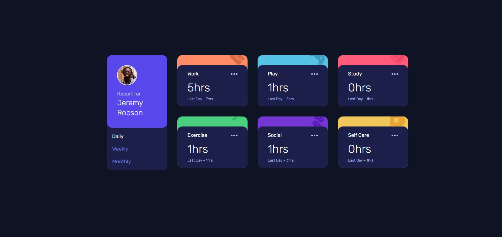

# Frontend Mentor - Time tracking dashboard solution

This is a solution to the [Time tracking dashboard challenge on Frontend Mentor](https://www.frontendmentor.io/challenges/time-tracking-dashboard-UIQ7167Jw). Frontend Mentor challenges help you improve your coding skills by building realistic projects.

## Table of contents

- [Overview](#overview)
  - [The challenge](#the-challenge)
  - [Screenshot](#screenshot)
  - [Links](#links)
- [My process](#my-process)
  - [Built with](#built-with)
  - [What I learned](#what-i-learned)
  - [Continued development](#continued-development)
  - [Useful resources](#useful-resources)
- [Author](#author)
- [Acknowledgments](#acknowledgments)

## Overview

### The challenge

Users should be able to:

- View the optimal layout for the site depending on their device's screen size
- See hover states for all interactive elements on the page
- Switch between viewing Daily, Weekly, and Monthly stats

### Screenshot

### Links

- Solution URL: [Add solution URL here](https://your-solution-url.com)
- Live Site URL: [Add live site URL here](https://your-live-site-url.com)

## My process

### Built with

- Semantic HTML5 markup
- CSS custom properties
- Flexbox
- CSS Grid
- Mobile-first workflow
- [React](https://reactjs.org/) - JS library
- [Tailwind](https://tailwindcss.com/) - CSS Framework

### What I learned

In this new challenge, I learned about useState and useEffect in React to create more dynamic and avtive page. I also learned how to use Tailwind in React app.

### Continued development

In the next future project, i would like to make multiple pages website/app using React Router.

### Useful resources

- [Web Dev Simplified](https://www.youtube.com/c/WebDevSimplified) - This Youtube Channel helped me for learning about useState and useEffect in React.

## Author

- Website - [Abam](https://abams.vercel.app/)
- Frontend Mentor - [@Zulfaabam](https://www.frontendmentor.io/profile/Zulfaabam)
- Twitter - [@zabamz1](https://www.twitter.com/zabamz1)

## Acknowledgments

-
